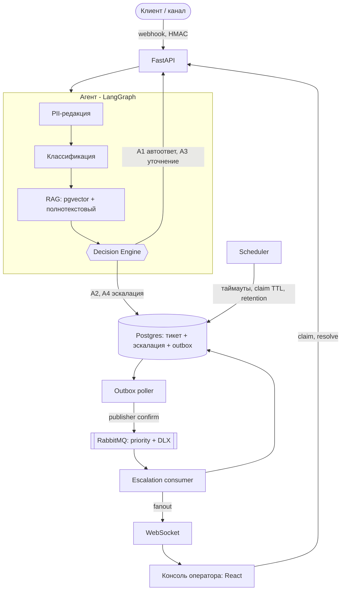

# Support-агент

[](https://github.com/Vladee101/supporta/actions/workflows/ci.yml)

AI-агент службы поддержки: классифицирует обращение, ищет ответ в базе знаний
(RAG) и **детерминированно** решает - ответить самому, запросить уточнение или
передать оператору. Оператор работает в собственной консоли и видит всё, что
видел агент.

Проект начинался с design document, а код писался под него, а не наоборот:
[Support-агент — Design Document.md](Support-агент%20—%20Design%20Document.md) -
требования и критерии приемки, use cases, decision table, ERD, API-контракты,
12 ADR, стратегия тестирования, SLI и risk register. Правила маршрутизации,
пороги и схема данных в коде ссылаются на разделы документа.

## Ключевые решения

| Решение | Почему | Где |
| --- | --- | --- |
| Маршрут выбирает код, а не LLM | Решение воспроизводимо и тестируемо, текст тикета физически не может изменить маршрут (prompt injection) | ADR-001, [decision.py](app/domain/decision.py) |
| Нет поведения по умолчанию | Непокрытая комбинация входов - эскалация и алерт, а не случайный автоответ; полный перебор 144 комбинаций в тестах | Decision table, R-default |
| Postgres - source of truth, RabbitMQ - транспорт | Тикет, эскалация и событие пишутся одной транзакцией (transactional outbox), consumer идемпотентен через inbox | ADR-004, ADR-007 |
| Провайдер LLM выбирается замером | Зарубежные API недоступны из РФ (152-ФЗ); адаптеры GigaChat и OpenAI-совместимых API; замер на golden set, а не выбор по таблице | ADR-009 |
| Уверенность LLM сверяется с базовой линией | Замер показал: без logprobs голоса модели единогласны даже на ошибках; расхождение с локальным словарным классификатором ловит ошибки бесплатно | ADR-012, [classifier.py](app/services/classifier.py) |
| Гибридный поиск по базе знаний | Включён по триггеру из ADR-010 (Recall@5 < 0.9): полнотекстовый поиск Postgres с русской морфологией + вектор, слияние по RRF; с bge-m3 Recall@5 = 0.92 | ADR-010, [retrieval.py](app/services/retrieval.py) |
| Порог RAG откалиброван, а не задан | Исходные 0.7 «под bge-m3» ни разу не проверялись и отсекали 60% вопросов, на которые есть ответ; калибровка на golden set + вопросах вне базы знаний дала 0.60 | «Confidence и пороги», [calibrate_rag.py](scripts/calibrate_rag.py) |
| Версии документов KB вместо удаления | Аудит решения показывает ровно тот текст, который видел агент | ADR-011 |

## Архитектура



Подробно - component и sequence diagram, диаграмма состояний тикета и ERD в
design document.

## Результаты

Отчёт по NFR собирается скриптом из артефактов прогонов, числа руками не вносятся -
[reports/nfr_report.md](reports/nfr_report.md). Итог: **9 из 10 выполнено**.

| | Порог | Замер |
| --- | --- | --- |
| NFR1: p95 автоответа | ≤ 8 с | 6.30 с (до исправлений по нагрузочному тесту - 12.98 с) |
| NFR8: одновременных тикетов | 50 без деградации | 50: p95 6.30 с, 0% ошибок; 100: p95 6.41 с |
| NFR10: успешных prompt injection | 0 | 0 из 24 |
| NFR2: recall жалоб, возвратов / macro-F1 | ≥ 0.95 / ≥ 0.85 | 0.96, 1.00 / 0.90 (базовая линия: 0.66, 0.90 / 0.80) |
| Recall@5 поиска по базе знаний | ≥ 0.90 | 0.92 (bge-m3, гибрид) |
| Автоответов без опоры на документ | < 5% | 3.2% при τ_rag = 0.60 |
| Автоответ на неоднозначные / ошибочных автоответов | 0 / - | 0 / 0 |
| NFR5: стоимость на тикет | ≤ $0.02 | не измерено: расход токенов пока не пишется в трейс |

Качество измерено на `yandex/aliceai-llm-flash` (Яндекс, обработка в РФ) через
RouterAI - OpenAI-совместимый адаптер заработал без изменений кода. Первый
прогон нашёл то, чего не видно в таблице метрик: модель не отдаёт logprobs, а пять
голосов k-sampling единогласны на 357 из 359 обращений, включая 34 из 35 ошибок, -
порог уверенности ничего не отсекал, и «Здравствуйте» получило автоответ.
Решение - сверка с детерминированной базовой линией (ADR-012): ноль автоответов
на неоднозначные обращения и ноль ошибочных автоответов при тех же recall и F1, а
классификация в 5 раз дешевле (k = 1). Цена - на 30% меньше автоответов.
Подробности и ограничения замера - в ADR-009 и ADR-012.

Что проверяет CI ([ci.yml](.github/workflows/ci.yml)): ruff; миграции применяются
на чистую базу и совпадают с моделями (`alembic check`); unit- и
интеграционные тесты на Python 3.11 и 3.14 против живых Postgres (pgvector) и
RabbitMQ - без инфраструктуры они падают, а не пропускаются; eval на golden set
с гейтом по метрикам безопасности; проверка типов и сборка консоли.

## Быстрый старт

Нужны Python ≥ 3.11, Docker и Node.js 22 (для консоли). Команды - для Windows;
на Linux/macOS вместо `.venv/Scripts/python.exe` - `.venv/bin/python`.

```bash
python -m venv .venv
.venv/Scripts/python.exe -m pip install -e ".[dev]"
cp .env.example .env
docker compose up -d
.venv/Scripts/python.exe -m alembic upgrade head
.venv/Scripts/python.exe -m scripts.seed_kb
.venv/Scripts/python.exe -m scripts.index_kb --provider hashing
.venv/Scripts/python.exe -m pytest
```

`--provider hashing` - офлайновые векторы без скачивания модели; с ними нужен свой
порог RAG (`RAG_CONFIDENCE_THRESHOLD=0.15`, см. `.env.example`). Production-связка -
bge-m3 (ADR-006), она тянет ~2.3 ГБ весов:

```bash
.venv/Scripts/python.exe -m pip install -e ".[embeddings]"
.venv/Scripts/python.exe -m scripts.index_kb --provider bge --reindex
.venv/Scripts/python.exe -m scripts.calibrate_rag --provider bge
```

Если загрузка весов зависает на 0 байт (протокол Xet через HTTP-прокси), помогает
`HF_HUB_DISABLE_XET=1`.

Живой стек: API, воркеры и консоль - см. разделы «Эскалации» и «Консоль оператора»
ниже; все команды собраны в [Makefile](Makefile).

## Структура

```
app/
  domain/decision.py   Decision Engine: правила R1-R10, R-default - чистая функция без I/O
  agent/               LangGraph: redact → classify → retrieve → decide → act; запись одной транзакцией
  services/            PII-редакция, классификатор, embeddings, retrieval, генерация, адаптеры LLM
  api/                 REST и WebSocket: тикеты, эскалации, KB, аудит
  escalations/         запись эскалации, consumer, claim, таймауты
  messaging/           топология RabbitMQ, publisher с confirm, outbox, мост в WebSocket
  workers/             outbox poller, escalation consumer, scheduler; переподключение с backoff
  kb/                  версии документов и фоновая индексация
  retention.py         вычистка персональных данных по сроку хранения (NFR4)
  db/models.py         схема из ERD
  core/                конфиг (пороги и таймауты), токены и подписи
console/               консоль оператора: React 19 + TypeScript + Vite
migrations/            alembic 0001-0007
scripts/               seed/index KB, golden set, eval, нагрузочный тест, отчёт по NFR, демо
eval/                  golden set (359), adversarial-набор (24), отчёт метрик
reports/               результаты нагрузочного теста и отчёт по NFR
tests/                 unit и интеграционные (маркер `integration`)
```

## Decision Engine

Ядро проекта. Маршрут выбирает код, а не LLM (ADR-001), поэтому решение
воспроизводимо, тестируемо и не подвержено prompt injection: текст тикета
физически не может изменить маршрут.

```python
from app.domain.decision import DecisionInput, decide
from app.domain.enums import Category

decide(DecisionInput(Category.REFUND, rag_confidence=0.99, class_confidence=0.99))
# Decision(action=A2, rule_id='R2/R3', reason='high_risk_category', priority=0)
```

Три свойства, ради которых он написан именно так:

- **порядок правил - часть спецификации**: срабатывает первое совпавшее, иначе
  R7b и R8 перекрываются;
- **нет поведения по умолчанию**: непокрытая комбинация даёт `R-default` -
  эскалацию и алерт `decision_table_gap`, а не случайный автоответ клиенту;
- **пороги снаружи**: 0.85 и 0.7 калибруются на golden set и живут в конфиге.

Тесты (`tests/test_decision_engine.py`): по одному каноническому случаю на каждую
строку таблицы, 5 инвариантов из документа, полный перебор 144 комбинаций входа
с проверкой, что ни одна не попадает в `R-default`, границы порогов и проверка,
что недостижимых правил нет.

## Оценка качества

```bash
.venv/Scripts/python.exe -m scripts.gen_golden_set          # golden set: 359 тикетов
.venv/Scripts/python.exe -m scripts.index_kb --provider hashing --reindex
.venv/Scripts/python.exe -m scripts.eval --rag-threshold 0.15
```

`scripts/eval.py` печатает таблицу «метрика / порог / замер / дельта» и сохраняет
`eval/report.json`; с флагом `--gate` возвращает ненулевой код при провале порога -
это и есть гейт для CI из раздела «Методика оценки». `--gate-metrics` сужает
проверку до перечисленных метрик: CI сейчас гейтит `--gate-metrics safety`
(доля успешных инъекций и автоответов на неоднозначные обращения) - они держатся
архитектурой и обязаны проходить уже на базовой линии, а гейт по NFR2 на
словарном классификаторе был бы красным всегда.

**Как читать цифры.** `eval/report.json` - базовая линия: словарный
классификатор и хеширующие векторы вместо LLM и bge-m3, нижняя граница, а не
результат системы. Прогоны провайдера сохраняются отдельно
(`eval/report_<модель>.json`) вместе с предсказанием по каждому обращению
(`--predictions-out`): Decision Engine - чистая функция, поэтому пороги можно
перекалибровать по этому файлу офлайн, не повторяя платные вызовы.
`eval/report_baseline_bge-m3.json` - та же базовая линия, но с bge-m3: Recall@5
0.92 в гибридном поиске (0.89 только вектором; на хеширующих векторах - 0.83).
Recall@5 от выбора LLM не зависит. Порог RAG передаётся флагом, потому что
косинусная шкала не переносится между моделями: 0.60 откалиброван под bge-m3
(`scripts.calibrate_rag`), у хеширующего провайдера верх выдачи лежит в районе
0.2-0.5 и порог ~0.15. Для калибровки к golden set добавлен
`eval/out_of_kb.jsonl` - 36 вопросов, ответа на которые в базе знаний нет: без
них любой порог выглядит безопасным.

Известные ограничения golden set: он полностью синтетический (ручное ядро плюс
шаблоны), доли из публичных датасетов в нём нет, поэтому он проверяет поведение
на ожидаемых формулировках, но не устойчивость к реальному языку клиентов.
Groundedness по документу размечается вручную и в автоматический прогон не входит.

## Эскалации (этап 4)

Цепочка процессов:

```
агент ─(одна транзакция)─► escalations + outbox_events
outbox poller ─(confirm)─► RabbitMQ: escalations.created (priority, DLX)
escalation consumer ─► Postgres (inbox + статус) ─► escalations.notify (fanout)
API: мост ─► WebSocket консоли        REST: очередь / контекст / claim / resolve
scheduler ─► таймауты уточнения (NFR9), истёкшие claim'ы (FR10), retention (NFR4)
```

Запуск (каждый - отдельным процессом):

```bash
.venv/Scripts/python.exe -m app.workers.outbox_poller
.venv/Scripts/python.exe -m app.workers.escalation_consumer
.venv/Scripts/python.exe -m app.workers.scheduler
.venv/Scripts/python.exe -m scripts.issue_token --email anna@example.com --name "Анна"
```

API с мостом уведомлений - `WS_BRIDGE_ENABLED=true` в `.env`.

Гарантии доставки: поллер - at-least-once (публикация подтверждается
publisher confirm'ом до отметки `published`), consumer - дедупликация через
inbox `consumed_events` в той же транзакции, что и смена статуса тикета, ack -
только после commit'а. Сообщение, которое нельзя обработать, уходит в
`escalations.dead`, а не крутится в очереди.

Временная недоступность Postgres или RabbitMQ воркеры не роняет: они пережидают
сбой с экспоненциальной паузой и продолжают работу сами, а эскалации, созданные
за время простоя брокера, копятся в outbox и доставляются после восстановления.
Проверено остановкой контейнеров на живом стенде.

## Консоль оператора (этап 5)

React + TypeScript (Vite), каталог `console/`. API отдаёт сборку по адресу
`/console`:

```bash
cd console && npm install && npm run build
.venv/Scripts/python.exe -m uvicorn app.main:app --port 8000   # http://localhost:8000/console/
```

Для разработки - `npm run dev` в `console/` (порт 5173, REST и WebSocket
проксируются на :8000). Вход - по токену оператора из `scripts.issue_token`;
раздел «База знаний» видит только роль `admin`.

Что есть в консоли: очередь с приоритетами и live-обновлением по WebSocket
(при обрыве - опрос по таймеру), карточка эскалации с перепиской, классификацией
и найденными документами (снапшоты - то, что видел агент), claim / ответ /
возврат в очередь, audit trail тикета, CRUD базы знаний с историей версий и
индикатором фоновой индексации.

Попробовать на живом стеке (нужны работающие API, outbox poller и consumer):

```bash
.venv/Scripts/python.exe -m scripts.demo_tickets
```

## Нагрузка и отчёт по NFR (этап 6)

Нагрузочный стенд изолирован: отдельная база `support_load` и vhost `load` в
RabbitMQ (`loadtest.env`), чтобы тестовые тикеты не смешивались с рабочими, а
рабочий consumer не получал чужие события. Задержка LLM имитируется в пределах
бюджета шагов из design document (`SIMULATED_LLM_*_MS`) - без этого базовая
линия отвечает за миллисекунды и тест мерил бы пустую оболочку.

```bash
.venv/Scripts/python.exe -m scripts.serve --env-file loadtest.env --port 8100
.venv/Scripts/python.exe -m scripts.load_test --env-file loadtest.env --label fixed
.venv/Scripts/python.exe -m scripts.nfr_report
```

(поллер и consumer стенда запускаются с `DATABASE_URL` и `RABBITMQ_URL` из `loadtest.env`)

Первый прогон нашёл три дефекта ёмкости: гонку в `lru_cache`-синглтонах (движок
SQLAlchemy на каждый поток первой волны), удержание соединения с базой на время
ожидания LLM и пул потоков anyio в 40 при 50 одновременных тикетах. Результаты до
и после - в [reports/nfr_report.md](reports/nfr_report.md).

## LLM-провайдер (ADR-009)

По умолчанию `LLM_PROVIDER=baseline`: словарный классификатор и шаблонные ответы,
без сети и ключей. Адаптеры в `app/services/llm_adapters`:

- `openai_compatible` - YandexGPT, vLLM и любой API в формате OpenAI Chat Completions;
- `gigachat` - собственный контракт Сбера (OAuth, chat completions v2).

Общее ядро: retry по NFR6 (до трёх повторов в пределах 10 с, 4xx не повторяются),
категории кодируются цифрами, чтобы распределение читалось из `top_logprobs`,
и режим `auto` - logprobs, если провайдер их отдаёт, иначе k-sampling. Поверх -
сверка с базовой линией (`LLM_CROSS_CHECK`, ADR-012). Настройки - в `.env.example`,
раздел «LLM-провайдер». Пример - Alice AI через RouterAI:

```
LLM_PROVIDER=openai_compatible
LLM_BASE_URL=https://routerai.ru/api/v1
LLM_API_KEY=...
LLM_CLASSIFY_MODEL=yandex/aliceai-llm-flash
LLM_GENERATE_MODEL=yandex/aliceai-llm-flash
```

Сравнение провайдеров на golden set (платный прогон, поэтому нужен явный флаг):

```bash
.venv/Scripts/python.exe -m scripts.eval --classifier configured --confirm-cost --rag-threshold 0.15     --report eval/report_<модель>.json --predictions-out eval/predictions_<модель>.jsonl
```

OpenAI-совместимый адаптер проверен на живом провайдере (Alice AI Flash через
RouterAI), GigaChat - только на имитированном. Соединение с провайдером должно
быть прямым: через локальный HTTP-прокси установка TLS занимала до 50 с при 0.3 с
на сам ответ.

## Статус по этапам

| Этап | Содержание | Статус |
| --- | --- | --- |
| 0 | Доработка design document (дыра в decision table, ERD, метрики, риски) | готово |
| 1 | Каркас, схема БД, миграции, seed базы знаний | готово |
| 2 | Decision Engine + тесты | готово |
| 3 | Классификация, RAG, генерация, PII-редакция, eval на golden set | готово |
| 4 | Эскалации: транзакция + outbox + RabbitMQ + consumer + WS | готово |
| 5 | Ingestion API, Operator Console, KB admin | готово |
| 6 | Нагрузочный тест, отчёт «замер vs порог» по NFR | готово - [reports/nfr_report.md](reports/nfr_report.md) |
| - | Устойчивость воркеров к сбоям инфраструктуры, CI | готово |
| - | Замер LLM на golden set, сверка уверенности с базовой линией (ADR-012) | готово: NFR2 выполнен |
| - | Стоимость на тикет (NFR5), задержка провайдера под нагрузкой | не измерено |
